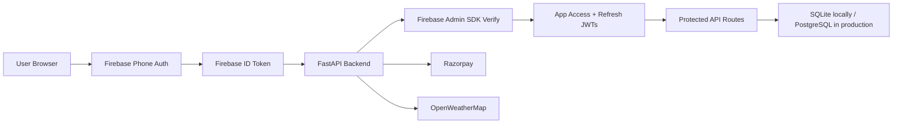

# SafeFlow.ai

Production hardening for the Guidewire DevTrails Phase 3 project, upgraded toward a real SaaS deployment model.

## Architecture



## Stack

- Frontend: HTML, CSS, vanilla JavaScript
- Client auth: Firebase Phone Authentication with reCAPTCHA
- Backend: FastAPI, SQLAlchemy
- Server auth: Firebase Admin SDK + app-issued access/refresh JWTs
- Database: SQLite locally, PostgreSQL-ready via `DATABASE_URL`
- Payments: Razorpay with backend signature verification and transaction tracking

## What Was Fixed

- Replaced the primary custom OTP flow with a Firebase phone-auth to backend JWT bridge.
- Added short-lived access tokens, rotating refresh tokens, and refresh-session revocation.
- Locked worker-scoped APIs to the authenticated worker instead of trusting URL IDs.
- Added payment transaction tracking and idempotent verification to prevent duplicate effects.
- Added request/error logging and a safer app bootstrap path for production debugging.
- Added automated tests for Firebase exchange, refresh, unauthorized access, and payment idempotency.
- Integrated an end-to-end wallet withdrawal pipeline with strict limits, balance validation, and admin payout approvals.

## API Overview

- `POST /api/auth/firebase/exchange`
- `POST /api/auth/refresh`
- `POST /api/auth/logout`
- `POST /api/auth/admin/login`
- `GET /api/auth/me`
- `PUT /api/auth/profile`
- `GET /api/weather`
- `GET /api/risk`
- `GET /api/wallet/{worker_id}`
- `GET /api/workers/{worker_id}/stats`
- `GET /api/policy/plans`
- `GET /api/policy/my-policy`
- `POST /api/payment/create-order`
- `POST /api/payment/verify`
- `POST /api/payment/create-wallet-order`
- `POST /api/payment/verify-wallet`
- `POST /api/payment/wallet-pay`
- `POST /api/payment/webhook`
- `POST /api/payment/withdraw`
- `GET /api/admin/withdrawals`
- `POST /api/admin/withdrawals/{ref}/approve`

## Local Setup

1. Copy `.env.example` to `.env`.
2. Add Firebase Admin credentials using one of:
   - `FIREBASE_CREDENTIALS_PATH`
   - `FIREBASE_SERVICE_ACCOUNT_JSON`
   - `FIREBASE_SERVICE_ACCOUNT_BASE64`
3. Provide Firebase public web config either through backend env vars or by injecting it before `frontend/js/config.js`:

```html
<script>
  window.__FIREBASE_CONFIG__ = {
    apiKey: "...",
    authDomain: "...",
    projectId: "...",
    appId: "...",
    messagingSenderId: "..."
  };
</script>
```

Supported public env vars:

```bash
FIREBASE_API_KEY=
FIREBASE_AUTH_DOMAIN=
FIREBASE_PROJECT_ID=
FIREBASE_APP_ID=
FIREBASE_MESSAGING_SENDER_ID=
```

4. Install dependencies:

```bash
pip install -r requirement.txt
pip install pytest
```

5. Start the app:

```bash
uvicorn backend.main:app --reload --port 8000
```

6. Open [http://localhost:8000](http://localhost:8000).

## Testing

```bash
python -m pytest -q
```

Current result: `4 passed`

## Docker

```bash
docker compose up --build
```

## Deployment

### Frontend

- Vercel is the intended frontend host.
- Inject the Firebase web config with environment variables at deploy time.
- Point API requests at the backend origin and keep Firebase config out of tracked source-specific values.

### Backend

- Render or AWS App Runner are the intended backend hosts.
- Set `DATABASE_URL` to PostgreSQL in production.
- Set `ALLOWED_ORIGINS` to exact frontend origins.
- Provide Firebase Admin credentials through secret env vars only.
- Provide Razorpay secrets through secret env vars only.

## CI/CD

- GitHub Actions workflow: `.github/workflows/ci.yml`
- Pipeline steps:
  - install dependencies
  - run tests
  - build Docker image

## Reference Docs

- Firebase Admin token verification: [firebase.google.com/docs/auth/admin/verify-id-tokens](https://firebase.google.com/docs/auth/admin/verify-id-tokens)
- Firebase phone auth on web: [firebase.google.com/docs/auth/web/phone-auth](https://firebase.google.com/docs/auth/web/phone-auth)
- Firebase Admin setup: [firebase.google.com/docs/admin/setup](https://firebase.google.com/docs/admin/setup)
